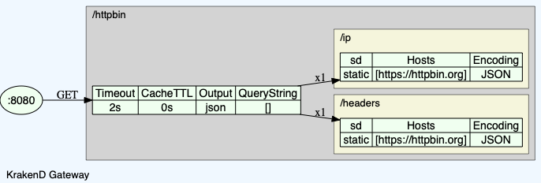

krakend
=======

[KrakenD][1] is a high-performance open source API Gateway.

Its core functionality is to create an API that acts as an aggregator of many
microservices into single endpoints, doing the heavy-lifting automatically for
you: aggregate, transform, filter, decode, throttle, auth and more.


## krakend config

<details>
<summary>krakend.json</summary>

```json
{
  "version": 2,
  "name": "My httpbin gateway",
  "port": 8080,
  "endpoints": [
    {
      "endpoint": "/httpbin",
      "backend": [
        {
          "host": [
            "https://httpbin.org"
          ],
          "url_pattern": "/headers"
        },
        {
          "host": [
            "https://httpbin.org"
          ],
          "url_pattern": "/ip"
        }
      ]
    }
  ]
}
```
</details>

```
$ krakend-config2dot -c krakend.json | dot -Tpng -o krakend.png
```



## up and running

```bash
$ docker-compose up -d

$ curl http://localhost:8080/httpbin
{
  "headers": {
    "Accept-Encoding": "gzip",
    "Host": "httpbin.org",
    "User-Agent": "KrakenD Version 1.0.0"
  },
  "origin": "172.17.0.1, 1.2.3.4, 172.17.0.1"
}
```

[1]: https://www.krakend.io/
