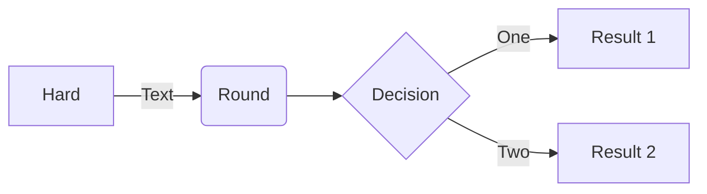

mermaid-cli
===========

[Mermaid][1] is a JavaScript-based diagramming and charting tool that uses
Markdown-inspired text definitions and a renderer to create and modify complex
diagrams. The main purpose of Mermaid is to help documentation catch up with
development.

## Tutorial

```
flowchart LR

A[Hard] -->|Text| B(Round)
B --> C{Decision}
C -->|One| D[Result 1]
C -->|Two| E[Result 2]
```



```bash
# Create an alias
$ alias mermaid-cli='docker run --rm -u $(id -u):$(id -g) -v $PWD:/data minlag/mermaid-cli'

# Make config file
$ cat input.mmd

# Generate an SVG
$ mermaid-cli -i input.mmd -o output.svg -t dark -b transparent
```

[1]: https://github.com/mermaid-js/mermaid
