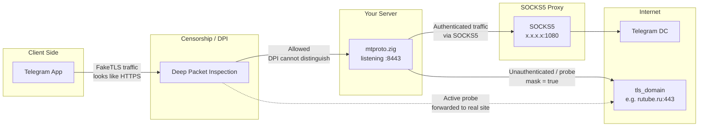

mtproto.zig
===========

[mtproto.zig][1] is a tiny Telegram proxy you run on your own server.
It hides inside ordinary HTTPS, so censorship can't find it —
and your family can't lose it. One command to set up, one link to share.

## Up and Running



> [!Caution]
> OS-level mitigations (iptables TCPMSS, nfqws, tunnel policy routing, masking/recovery units) are not applied inside the container;
> only the proxy binary runs there.

```bash
$ mkdir data
$ wget -O data/config.toml https://github.com/sleep3r/mtproto.zig/blob/main/config.toml.example
$ vim data/config.toml
$ docker compose up -d
$ curl http://127.0.0.1:9400/metrics
$ docker compose kill -s HUP
$ mtbuddy links --config data/config.toml
```

How to encode Fake-TLS in Hex:
If your raw secret is `c5d1717f50bdab002e1ba52d9ed8f2fe` and you want to use the domain `dl.google.com`:

1. Convert the domain name string directly to hex:  
     dl.google.com → 646c2e676f6f676c652e636f6d (`echo -n "dl.google.com" | xxd -p`)
2. String them all together:  
     ee + c5d1717f50bdab002e1ba52d9ed8f2fe + 646c2e676f6f676c652e636f6d
3. Example Link:  
     tg://proxy?server=1.2.3.4&port=443&secret=eec5d1717f50bdab002e1ba52d9ed8f2e646c2e676f6f676c652e636f6d

> [!Tip]
> Download [mtbuddy][2]

[1]: https://github.com/sleep3r/mtproto.zig
[2]: https://github.com/sleep3r/mtproto.zig/releases/latest
