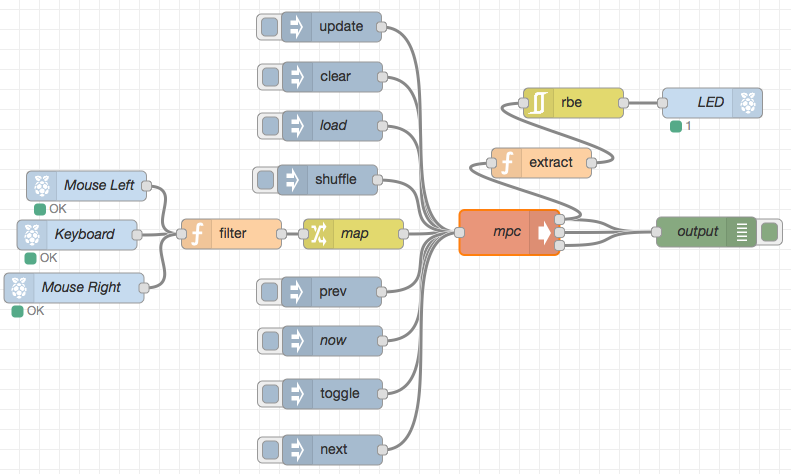

node-red
========


[Node-RED][1] is a tool for wiring together hardware devices, APIs and online
services in new and interesting ways.



## directory tree

```
~/fig/node-red/
├── docker-compose.yml
└── node-red/
    ├── flows_cred.json
    ├── flows.json
    ├── lib/
    │   └── flows
    └── settings.js
```

> The `node-red` directory will be created after first running.

## docker-compose.yml

```yaml
node-red:
  image: vimagick/node-red
  ports:
    - "1880:1880"
  volumes:
    - ./data:/root/.node-red
  restart: always
```

## settings.js

```javascript
module.exports = {

    //...

    flowFile: 'flows.json',

    //...

    adminAuth: {
        type: "credentials",
        users: [{
            username: "admin",
            password: "$2a$08$zZWtXTja0fB1pzD4sHCMyOCMYz2Z6dNbM6tl8sJogENOMcxWV9DN.",
            permissions: "*"
        }],
        default: {
            permissions: "read"
        }
    },

    //...

}
```

> Password hash can be generated by running `node-red-admin hash-pw`.

## up and running

```
$ cd ~/fig/node-red/
$ docker-compose up -d
$ docker-compose exec node-red node-red-admin hash-pw
$ vi data/settings.js
$ docker-compose exec node-red bash
>>> cd /root/.node-red
>>> apk add -U build-base
>>> npm install node-red-node-irc
>>> npm install node-red-node-daemon
>>> exit
$ docker-compose restart
```

> Install nodes from [node-red-nodes](https://github.com/node-red/node-red-nodes).

[1]: http://nodered.org/
