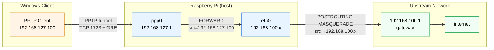

pptpd
=====


The Point-to-Point Tunneling Protocol is a method for implementing virtual private networks.

`PPTP` uses a control channel over TCP and a GRE tunnel operating to encapsulate PPP packets.

> [!Caution]
> PPTP (Point-to-Point Tunneling Protocol) is largely obsolete and actively discouraged for modern use,
> though it persists in very limited legacy or isolated environments.

## Directory Tree

```
~/fig/pptpd/
├── docker-compose.yml
└── data/
    ├── pptpd.conf
    ├── pptpd-options
    └── chap-secrets
```



## Server Setup

```bash
$ modprobe nf_conntrack_pptp nf_nat_pptp
$ lsmod | grep pptp
$ ls /dev/ppp

$ cd ~/fig/pptpd/
$ docker compose up -d
$ docker compose logs -f

$ sudo sysctl -w net.ipv4.ip_forward=1
$ iptables --version
iptables v1.8.9 (nf_tables)
$ sudo iptables -L FORWARD -n
$ sudo iptables -A FORWARD -i ppp+ -o eth0 -j ACCEPT
$ sudo iptables -A FORWARD -i eth0 -o ppp+ -m conntrack --ctstate RELATED,ESTABLISHED -j ACCEPT
$ sudo iptables -t nat -A POSTROUTING -o eth0 -j MASQUERADE
```

You need to config firewall:

- To let PPTP tunnel maintenance traffic, `allow port 1723/tcp`
- To let PPTP tunneled data to pass through router, `allow proto gre`
- Add required module names to `/etc/modules`
- Set `DEFAULT_FORWARD_POLICY=ACCEPT` (optional)
- Set `net.ipv4.ip_forward=1` in `/etc/sysctl.conf`

## Client Setup

Connect PPTP server using `username:password` with `mschap-v2/mppe-128` encyption.

```powershell
C:\> ipconfig /all
PPP adapter pptp:

   Connection-specific DNS Suffix  . :
   Description . . . . . . . . . . . : pptp
   Physical Address. . . . . . . . . :
   DHCP Enabled. . . . . . . . . . . : No
   Autoconfiguration Enabled . . . . : Yes
   IPv4 Address. . . . . . . . . . . : 192.168.127.100(Preferred)
   Subnet Mask . . . . . . . . . . . : 255.255.255.255
   Default Gateway . . . . . . . . . : 0.0.0.0
   DNS Servers . . . . . . . . . . . : 8.8.8.8
                                       8.8.4.4
   NetBIOS over Tcpip. . . . . . . . : Disabled

C:\> netsh interface ipv4 show interfaces

Idx     Met         MTU          State                Name
---  ----------  ----------  ------------  ---------------------------
 62          25        1400  connected     pptp
  1        4300  4294967295  connected     Loopback Pseudo-Interface 1
 17        4250        1500  connected     Ethernet

C:\> route print -4

C:\> netsh interface ipv4 show interfaces

C:\> netsh interface ipv4 show dnsservers

C:\> netsh interface ipv4 set dnsservers name="pptp" source=static address=8.8.8.8 register=primary

PS C:\> nslookup google.com
Server:  OpenWrt.lan
Address:  192.168.100.1

PS C:\> Get-DnsClientServerAddress -AddressFamily IPv4
InterfaceAlias               Interface Address ServerAddresses
                             Index     Family
--------------               --------- ------- ---------------
Ethernet                            17 IPv4    {192.168.100.1}
pptp                                62 IPv4    {8.8.8.8}
Loopback Pseudo-Interface 1          1 IPv4    {}

PS C:\> Get-NetIPInterface | Sort-Object InterfaceMetric
ifIndex InterfaceAlias                  AddressFamily NlMtu(Bytes) InterfaceMetric Dhcp     ConnectionState PolicyStore
------- --------------                  ------------- ------------ --------------- ----     --------------- -----------
62      pptp                            IPv4                  1300              25 Disabled Connected       ActiveStore
17      Ethernet                        IPv6                  1500              25 Enabled  Connected       ActiveStore
1       Loopback Pseudo-Interface 1     IPv4            4294967295            4300 Disabled Connected       ActiveStore

PS C:\> Set-NetIPInterface -InterfaceAlias "pptp" -AddressFamily IPv4 -InterfaceMetric 1

PS C:\> nslookup google.com
Server:  dns.google
Address:  8.8.8.8
```

> [!Caution]
> Why does nslookup still use DNS from Ethernet?  
> You need to lower the InterfaceMetric of pptp!

> [!Tip]
> To stop routing all traffice through VPN (Default Gateway: 0.0.0.0 -> empty)  
> Win+R run `ncpa.cpl` -> PPTP connection properties -> Networking -> IPv4 properties -> Advanced...
> - [ ] `Use default gateway on remote network`
> - [ ] `Interface metric` => `1` (lower than 25)

## References

- <https://wiki.archlinux.org/index.php/PPTP_server>
- <https://wiki.archlinux.org/index.php/PPTP_Client>
