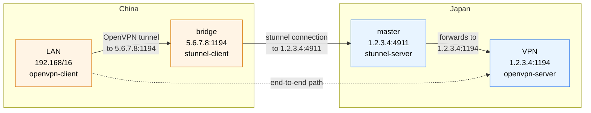

stunnel
=======

[Stunnel][1] is a proxy designed to add TLS encryption functionality to
existing clients and servers without any changes in the programs' code.

### Overview



domain | ip:port      | country | services
-------| ------------ | ------- | ------------------------------
VPN    | 1.2.3.4:1194 | Japan   | openvpn-server
master | 1.2.3.4:4911 | Japan   | stunnel-server
bridge | 5.6.7.8:1194 | China   | stunnel-client
LAN    | 192.168/16   | China   | openvpn-client

### Server Setup (Cloud)

```bash
# master server (Japan)
docker-compose up -d master
```

### Client Setup (Cloud)

```bash
# bridge server (China)
docker-compose up -d bridge
```

### Client Setup (Local)

File: /etc/stunnel/stunnel.conf

```ini
foreground = yes
client = yes

[openvpn]
accept = 127.0.0.1:1194
connect = 1.2.3.4:4911
```

> Pro Tip: Running stunnel locally is faster.

### OpenVPN Setup (Partial)

```ini
# For Cloud Setup
...
remote 5.6.7.8 1194 tcp
route 192.168.0.0 255.255.0.0 net_gateway
...
```

```ini
# For Local Setup
...
remote 127.0.0.1 1194 tcp
route 1.2.3.4 255.255.255.255 net_gateway
route 192.168.0.0 255.255.0.0 net_gateway
....
```

-----------------------------------------

### For Gmail Forwarding

```ini
;debug = info
;output = /var/log/stunnel.log
foreground = yes
setuid = stunnel
setgid = stunnel
socket = l:TCP_NODELAY=1
socket = r:TCP_NODELAY=1

[gmail-pop3]
client = yes
accept = 127.0.0.1:110
connect = pop.gmail.com:995

[gmail-imap]
client = yes
accept = 127.0.0.1:143
connect = imap.gmail.com:993

[gmail-smtp]
client = yes
accept = 127.0.0.1:25
connect = smtp.gmail.com:465
```

```nginx
stream {
    server {
        listen               995 ssl;
        ssl_certificate      ssl/easypi.crt;
        ssl_certificate_key  ssl/easypi.key;
        ssl_protocols        TLSv1 TLSv1.1 TLSv1.2;
        ssl_ciphers          HIGH:!aNULL:!MD5;
        proxy_pass           127.0.0.1:110;
        proxy_buffer_size    16k;
    }
    server {
        listen               993 ssl;
        ssl_certificate      ssl/easypi.crt;
        ssl_certificate_key  ssl/easypi.key;
        ssl_protocols        TLSv1 TLSv1.1 TLSv1.2;
        ssl_ciphers          HIGH:!aNULL:!MD5;
        proxy_pass           127.0.0.1:143;
        proxy_buffer_size    16k;
    }
    server {
        listen               465 ssl;
        ssl_certificate      ssl/easypi.crt;
        ssl_certificate_key  ssl/easypi.key;
        ssl_protocols        TLSv1 TLSv1.1 TLSv1.2;
        ssl_ciphers          HIGH:!aNULL:!MD5;
        proxy_pass           127.0.0.1:25;
        proxy_buffer_size    16k;
    }
}
```

[1]: https://www.stunnel.org/index.html
